The aim of this post is to create a virtualized work environment for testing Android applications. We will start by selecting the emulator, then we will download and configure other tools for auditing. I will finish by configuring BurpSuite to intercept traffic for further analysis and modification. Finally, I will also recommend some other useful scripts or applications for these activities.

# Creating the working environment

## Prerequisites

### Installing and running Android Debug Bridge (ADB)

Android Debug Bridge is a command line tool that will allow us to communicate with the mobile device and execute multiple instructions to perform different actions, such as copying or deleting information, installing or uninstalling applications, etc. To install it just run: `sudo apt install abd -y`

### Installing VirtualBox

VirtualBox is needed in Genymotion for virtualization, providing a platform to run and manage virtual Android devices. Before installing VB, install the required dependencies

`sudo apt install build-essential dkms`

Download & install it from the [official website](https://www.virtualbox.org/)

`wget [VirtualBox_Package_URL]`

`sudo dpkg -i [VirtualBox_Package_Name].deb`

### Installing OpenSSL

OpenSSL is an open-source tool that provides various cryptographic functions and utilities and is commonly used for secure communication, certificate handling, and cryptographic tasks.

### Installing Docker

## Installing and running the emulator (Genymotion)

When setting up the workspace, the first step is choosing an right emulator. An emulator acts like a virtual Android device, allowing users to run test their apps on a computer. There are several Android emulators available, such as [Android Studio](https://developer.android.com/studio), [Genymotion](https://www-v1.genymotion.com/account/create/), [Bluestacks](https://www.bluestacks.com/es/index.html)... choosing the "best" for you may depend on your preferences, but I'd recommend Genymotion because it is the one with which I have had no compatibility problem. So without further ado let's configure it:

For the emulator installation, I'd recommend installing it on the main operating system, not VM. Keep in mind that emulating an Android device requires a significant amount of memory so if you run it in an VM you may have processing or memory issues. I'm running Debian as main OS so I'll explain the installation on it. If you are using another OS follow the steps on the official site.

1.  After installing [ADB and VirtualBox](#prerequisites), create a Genymotion account here [https://www.genymotion.com](https://www.genymotion.com/). This will allow you to download genymotion.
2.  [Download](https://dl.genymotion.com/releases/genymotion-3.6.0/genymotion-3.6.0-linux_x64.bin "https://developer.android.com/studio") and install Genymotion. The installation is pretty straightforward, here are the steps to follow: [Official documentation](https://docs.genymotion.com/desktop/Get_started/013_Linux_install/)

3\. When Genymotion is running, click on "+" button to create a new Android Virtual Machine \*\*I do normally use Google Nexus 4 or 5, but feel free to use any of the list\*\*:

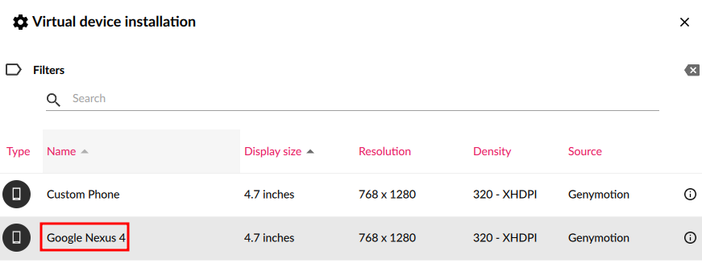

In the next Tab,select the desired Android version, I noramlly select Android 10.0 or 8.1 (oreo) for testing. Then press Next until the "Network Mode" tab, where brisged mode must be selected in order to capture traffic with Burpsuite:

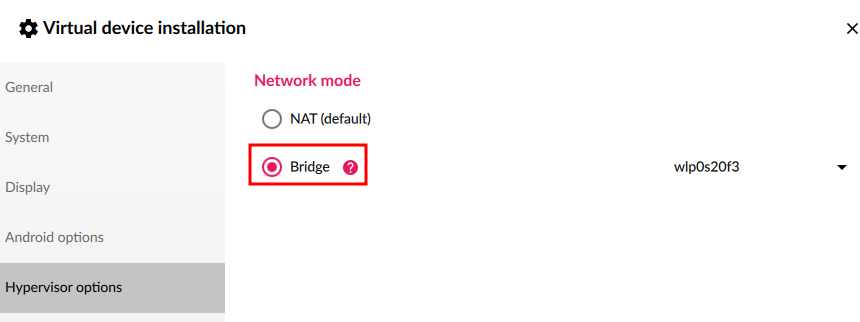

After that, the automatic installation will be finished and the virtual machine can be deployed. Once the machine is running and you have done the initial Android configuration, click on Open Gapps (in the right side) to be able to have Google applications such as "Play Store". 

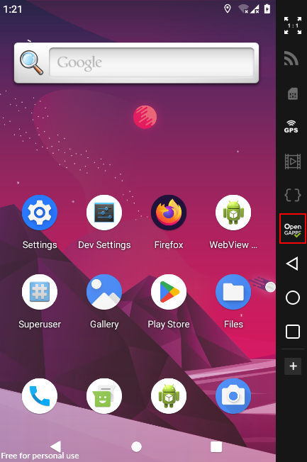  

## Intercepting requests with BurpSuite

Burp Suite is essential for Android pentesting as it acts as a proxy, allowing to intercept and inspect HTTP requests between the app and its server. By capturing and analyzing this traffic, we can identify vulnerabilities, manipulate data, and enhance the application's overall resilience to potential attacks. So after the brief introduction to Burp, install the application from the [official website](https://portswigger.net/burp/documentation/desktop/getting-started/download-and-install).

Once installed, create a new project and go to *Proxy tab > Proxy Settings* and a windows like the below will appear. Click on Import/export certificate

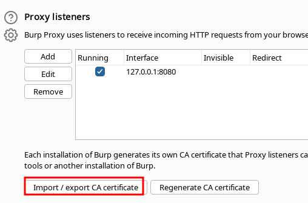

Export and save as "cacert.der" name:

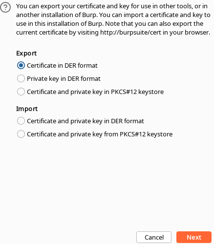

The certificates found in the device's system have the nomenclature "subject\_hash\_old.0", so it will be necessary to modify them using the [OpenSSL (installed above)](#h_4274194211441703335454891) tool.

Modify the certificate format from DER to PEM

`openssl x509 -inform DER -in cacert.der -out cacert.pem`

Obtain the value of the subject\_hash\_old hash from the generated certificate.:

`openssl x509 -inform PEM -subject_hash_old -in cacert.pem`

Rename the certificate with the previously mentioned subject\_hash\_old.0 nomenclature.

`move cacert.pem 9a5ba575.011`

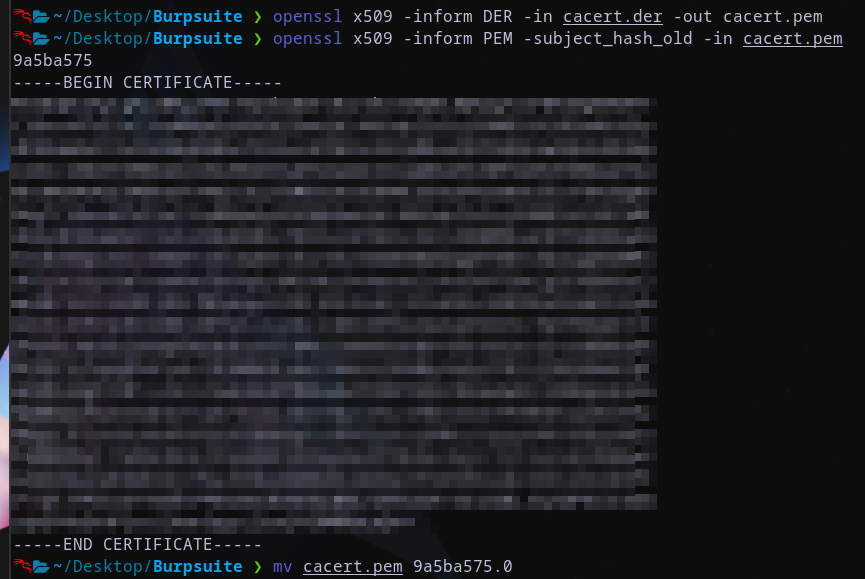

Alright, after these commands, the next steps involve working with the adb tool, [installed above](#installing-and-running-android-debug-bridge-adb) as a prerequisite

`adb root`

`adb remount`

`adb push 9a5ba575.0 /sdcard/`

`adb shell mv /sdcard/9a5ba575.0 /system/etc/security/cacerts`

`adb shell chmod 664 /system/etc/security/cacerts/9a5ba575.0`

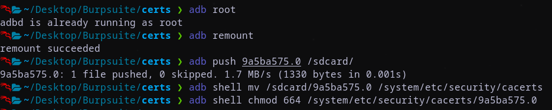

&nbsp;

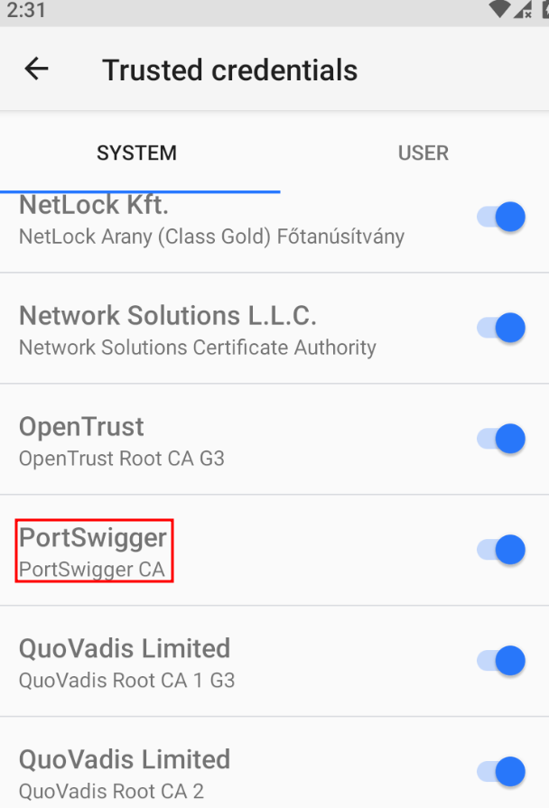

&nbsp;

&nbsp;

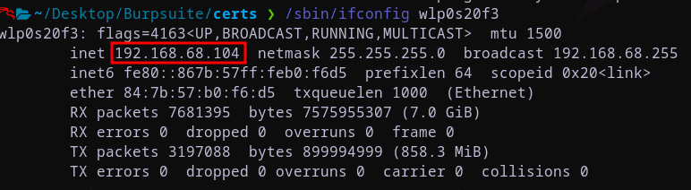

&nbsp;

&nbsp;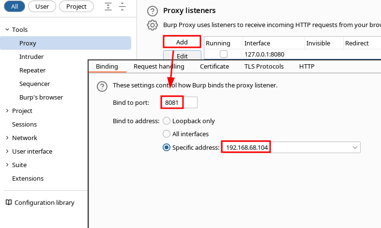

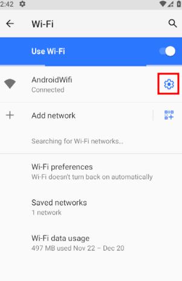

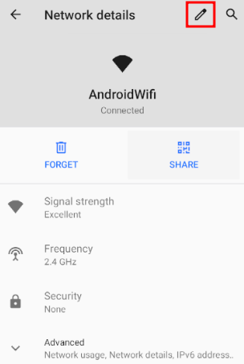

&nbsp;

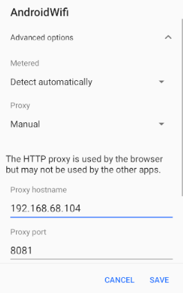

Now you should be able to intercept requests in BurpSuite

## Other useful (necessary) tools

### [Frida](https://github.com/frida/frida)

Frida is an open-source dynamic instrumentation framework that is invaluable for Android pentesting. It allows you to inject custom code into running Android applications, giving you the ability to monitor and manipulate their behavior in real-time. By hooking methods and modifying their functionality, Frida enables you to bypass security measures, analyze sensitive data, and uncover vulnerabilities that might otherwise go unnoticed.

`pip install frida-tools # CLI tools`  
`pip install frida # Python bindings`  
`npm install frida # Node.js bindings`

### [APKTool](https://github.com/iBotPeaches/Apktool)

APKTool is a popular tool used for reverse engineering and analyzing Android applications. It allows you to decompile and disassemble APK files, providing you with access to the application’s source code and resources. With APKTool, you can examine the inner workings of an application, identify security flaws, and even modify the code to patch vulnerabilities. It is an essential tool for understanding how Android apps function and for performing code-level analysis.

`sudo apt install apktool`

### [Drozer](https://github.com/WithSecureLabs/drozer)

Drozer is a comprehensive security assessment framework for Android that helps pentesters find security vulnerabilities in applications and devices. It provides a wide range of modules that can be used to perform various tasks, such as finding exported components, manipulating shared preferences, or exploiting known vulnerabilities. Drozer’s powerful functionality makes it an essential tool for both black-box and white-box testing scenarios.

`git clone https://github.com/WithSecureLabs/drozer.git`  
`cd drozer`  
`python setup.py bdist_wheel`

### [Inmuniweb](https://www.immuniweb.com/mobile/)

Mobile app security search engine. Scans and checks the security score of the mobile apps.s

### [Appsweep](https://appsweep.guardsquare.com/)

Mobile app security search engine. Scans and checks the security score of the mobile apps.

### [Bevigil](https://bevigil.com/) 

Mobile app security search engine. Scans and checks the security score of the mobile apps.

### [QARK](https://github.com/linkedin/qark)

QARK stands for “Quick Android Review Kit” and it was developed by LinkedIn. Is an easy-to-use tool capable of finding common security vulnerabilities in Android applications, it's a common tool to perform basic security checks for an Android application

```
cd qark
pip install -r requirements.txt
pip install . --user  # --user is only needed if not using a virtualenv
qark --help
```

### [zANTI](https://www.zimperium.com/zanti-mobile-penetration-testing/)

zANTI is a comprehensive network diagnostics toolkit that enables complex audits and penetration tests at the push of a button. It offers a comprehensive range of fully customizable scans to reveal everything from authentication, backdoor and brute-force attempts to database, DNS and protocol-specific attacks – including rogue access points.

To use it, download and run in on the Android VM

### [MobSF (Mobile Security Framework)](https://github.com/MobSF/Mobile-Security-Framework-MobSF)

MobSF is an open-source mobile app security testing framework that supports both Android and iOS platforms. It offers a comprehensive set of features, including static and dynamic analysis, vulnerability scanning, and API security testing. MobSF can analyze Android APK files, perform in-depth security assessments, and generate detailed reports highlighting potential security risks.

`docker pull opensecurity/mobile-security-framework-mobsf:latest`  
`docker run -it --rm -p 8000:8000 opensecurity/mobile-security-framework-mobsf:latest`

## [TestSSL](https://github.com/drwetter/testssl.sh)

SSLyze is a command-line tool used for analyzing SSL/TLS configurations and identifying potential vulnerabilities in the secure communication layer. It can be beneficial for Android pentesters to assess the SSL/TLS implementation of an application, detect weak cipher suites, expired certificates, or improper SSL/TLS configurations that could expose the app to security risks.

`git clone --depth 1 https://github.com/drwetter/testssl.sh.git`

## [Jadx](https://github.com/skylot/jadx)

JADX is a decompiler for Android applications that translates compiled Android application bytecode (Dex files) into human-readable Java source code. It is commonly used by developers and security researchers to analyze and understand the inner workings of Android applications.

`git clone https://github.com/skylot/jadx.git`  
`cd jadx`  
`./gradlew dist` 

### Nikto

Nikto is an open-source web server scanner that identifies potential security vulnerabilities and misconfigurations.

`sudo apt install nikto`

# Happy hacking

As we bid farewell for now, keep in mind that our exploration of Android security is just beginning. Stay tuned for a cascade of upcoming posts, where I will try to unravel the intricacies of vulnerable Android apps and dissect the top exploits that keep the cybersecurity realm on its toes. Your journey into the dynamic world of Android security has only just started, and I look forward to guiding you through each step. Until the next post, happy hacking $$